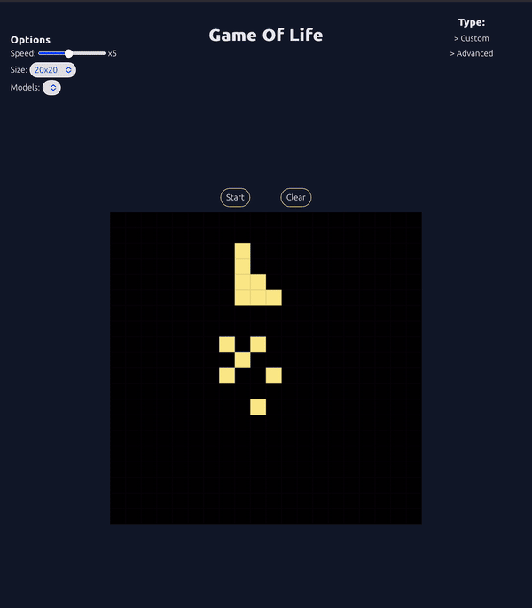

# 🧑‍💻 Game-Of-Life-Workshop

## 📝 Description

Le Jeu de la Vie de Conway est un automate cellulaire inventé par le mathématicien John Horton Conway en 1970. C'est un modèle simple qui simule l'évolution de cellules vivantes sur une grille en fonction de règles définies. Bien que cela puisse ressembler à un simple casse-tête, certaines configurations de cellules peuvent devenir étonnamment complexes... ou totalement imprévisibles !

## 🎯 Objectif

L'objectif de cet atelier est de vous apprendre à coder le Jeu de la Vie en utilisant un langage de programmation de votre choix. Vous allez découvrir comment des règles simples peuvent créer des comportements complexes — et vous pourrez même recréer une apocalypse de cellules ! 🧬⚡

## ✅ Prérequis

All you need is:

* VSCode 💻
* Javascript/TypeScript/React/Python/PHP  🛠️
* Word 🧑‍💻

## 🎮 Exemple du jeu

Voici un aperçu du résultat final. C'est parti pour la **renaissance et l'apocalypse cellulaire** :

## 🧩 Règles du Jeu

Le Jeu de la Vie se déroule sur une grille carrée où chaque cellule peut être vivante ou morte. L'évolution des cellules se fait selon les règles suivantes :

1. Une cellule vivante avec moins de deux voisines vivantes meurt (solitude, c'est triste 😢).
2. Une cellule vivante avec deux ou trois voisines vivantes survit (l'équilibre parfait, comme la sieste après le déjeuner 😴).
3. Une cellule vivante avec plus de trois voisines vivantes meurt (surpopulation — le métro aux heures de pointe 🚇).
4. Une cellule morte avec exactement trois voisines vivantes devient vivante (naissance, bienvenue dans le chaos 🌱).

## 🚀 Étapes de l'atelier

1. **Introduction à l'automate cellulaire** : Brève explication de ce qu'est un automate cellulaire et comment il fonctionne.
2. **Mise en place de la grille** : Implémentation d'une grille 2D où chaque cellule peut être soit vivante, soit morte.
3. **Implémentation des règles** : Codage des règles du jeu pour simuler l'évolution des cellules.
4. **Affichage visuel** : Si possible, création d'une interface pour visualiser l'évolution des cellules sur la grille.

## 🔗 Ressources

- [Conway's Game of Life - Wikipédia](https://fr.wikipedia.org/wiki/Jeu_de_la_vie)
- [Tutoriel Python pour le Jeu de la Vie](https://github.com/mon-exemple/python-game-of-life)

## 👥 Contributeurs

 🧔🏻‍♂️ [Arnaud](https://github.com/javadaller)
 👦🏻 [Tasha](https://github.com/NataliiaTasha)

 

## License

Ce projet est sous licence MIT.

